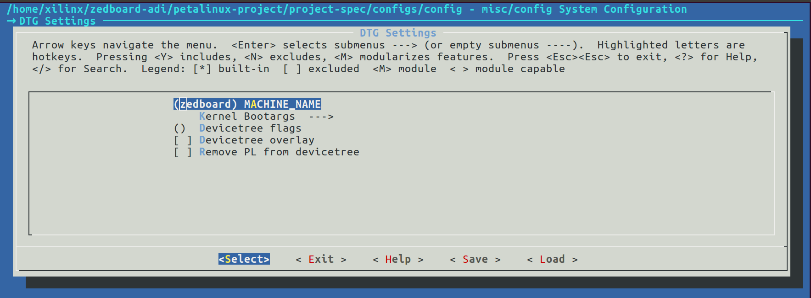
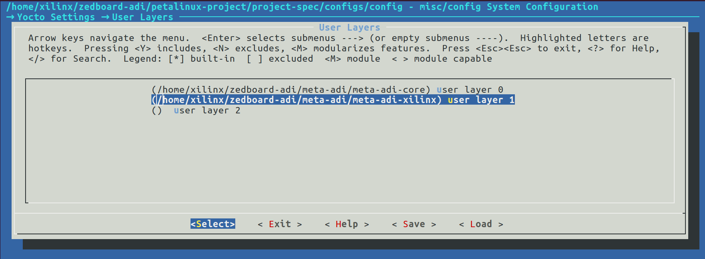
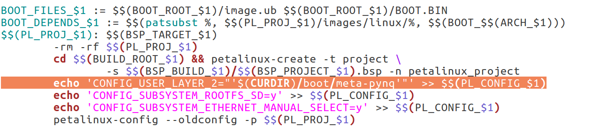
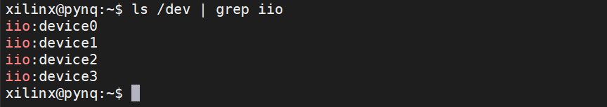
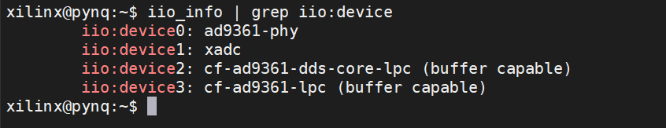

# ZedBoard PYNQ + AD9361

Instructions on how to build PYNQ on zedboard with ADI linux kernel.

* Building environment
  * Ubuntu 16.04
  * PetaLinux 2018.3
  * Vivado 2018.3
* Testing boards
  * V3 FMC9361_V1.0

## 1. Build HDL

Refer to [ADI's hdl repository](https://github.com/analogdevicesinc/hdl) to build a hardware project. You may switch to proper branches to match the petalinux and vivado version. Refer to [meta-adi](https://github.com/analogdevicesinc/meta-adi/tree/master/meta-adi-xilinx) for more information on different versions.

## 2. Create PetaLinux BSP

* Create a petalinux project

  ```bash
  petalinux-create -t project --template zynq --name zedboard-adi
  ```

* Clone meta-adi and checkout at branch `2019_R1`

  ```bash
  git clone https://github.com/analogdevicesinc/meta-adi.git
  cd meta-adi && git checkout 2019_R1 && cd ..
  ```

* Config project using the hardware descriptions (.hdf or .xsa files) exported from Vivado

  ```bash
  cd zedboard-adi
  petalinux-config --get-hw-description <path_to_hdf>
  ```

  After running petalinux-config, a configuration menu will come up.

  Go to DTG Settings, change MACHINE NAME to zedboard

  

  Go to Yocto Settings -> User Layers, add meta-adi-core and meta-adi-xilinx layers by typing the **absolute path** of those two folders.

  

  Save and exit.
  
  MAKE SURE `meta-adi-core` is above `meta-adi-xilinx`. That is to say, make sure the `meta-adi-core` is LAYER_0.

* Export petalinux bsp

  ```bash
  petalinux-package --bsp --project ./ --output ZedBoard-ADI.bsp
  ```

## 3. Build PYNQ

* Clone PYNQ and checkout at branch image_v2.4

  ```bash
  git clone https://github.com/Xilinx/PYNQ.git
  cd PYNQ && git checkout image_v2.4
  ```
* Setup environment
  ```bash
  sudo bash sdbuild/scripts/setup_host.sh
  
* Edit `sdbuild/Makefile`.

  

  In line 127, change `CONFIG_USER_LAYER_0` to `CONFIG_USER_LAYER_2`. (We edit this because by default it will add the meta-pynq layer to user layer 0, which will overwrite the meta-adi-core layer we added before.)

* Prepare board folder

  Create a new folder under `boards` with name ZedBoard-ADI. Copy bitstream and bsp file (exported from petalinux) into the new-created folder. Create a new file with name ZedBoard-ADI.spec, and add the following content

  ```
  ARCH_ZedBoard-ADI := arm
  BSP_ZedBoard-ADI := ZedBoard-ADI.bsp
  BITSTREAM_ZedBoard-ADI := system_top.bit
  STAGE4_PACKAGES_ZedBoard-ADI := ethernet
  ```
  
  Make sure the name of bsp and bitstream is correct.

* Prepare prebuilt image

  Download pynq v2.4 prebuilt image from [Xilinx official website](https://www.xilinx.com/member/forms/download/xef.html?filename=pynq_rootfs_arm_v2.4.zip)

* Run make

  ```bash
  cd sdbuild
  make BOARDS=ZedBoard-ADI PREBUILT=<path_to_prebuilt_image>
  ```

  After the compilation is finished, The SD card image is located in `sdbuild/output/`

## 4. Python bonding for libiio

Mount the AD9361 and power on the board, you should see four iio devices under /dev (one for xadc, three for ad3961)



Now we can install some libraries to drive the AD9361

* Install dependencies

  ```bash
  sudo apt update
  sudo apt install build-essential \
      libxml2-dev bison flex libcdk5-dev cmake \
      libaio-dev libusb-1.0-0-dev \
      libserialport-dev libavahi-client-dev \
      doxygen graphviz \
  ```

* Install libiio and pylibiio

  ```bash
  git clone https://github.com/analogdevicesinc/libiio.git
  cd libiio
  cmake ./
  make all
  sudo make install
  sudo ldconfig
  cd bindings/python/
  sudo python3 setup.py.cmakein install
  cd ~
  ```

  Now you can use `iio_info` to get the information of iio devices.

  

  Refer to [pyadi-iio](https://analogdevicesinc.github.io/pyadi-iio) to interact with AD9361 through python

## 5. Troubleshooting

* No device `eth0`

  If the built image has no device `eth0`, modify `/build/tmp/work_shared/plnx-zynq7/kernel-source/arch/arm/boot/dts/zynq-zed.dtsi`. Change phy@0 at line 23 to ethernet-phy@0

* `depmod ERROR: could not open directory /lib/modules/4.14.0-xilinx-v2018.3: No such file or directory`

  * Solution 1:

      Change LINUX_VERSION in Makefile from 4.14-xilinx-v2018.3 to that (4.14-xilinx-) in /lib/modules.

  * Solution 2 (not tested):

      ```bash
      petalinux-config -c kernel
      ```

      Go to General setup -> Local version, change `-xilinx-` to `-xilinx-v2018.3` 
      
  * Solution 3 (not tested):
      
      Adding the following line at PYNQ/sdbuild/Makefile line 127:
      ```
      echo 'CONFIG_LOCALVERSION="-xilinx-v2018.3"' >> $$(PL_CONFIG_$1)
      ```

* Network Error

  - Check .gitconfig for proxy settings. Makesure all proxy settings are right

      ```bash
      git config -l | grep proxy
      ```

  - Sometimes, git:// will not work, but https:// will work, so type this in shell:

      ```bash
      git config --global url."https://".insteadOf git://
      ```

  - Offline build will work around any network issue, so it is highly recommended. 
  
    Enable Offline Build by adding some configurations at PYNQ/sdbuild/Makefile line 127
      
      ```bash
      echo 'CONFIG_PRE_MIRROR_URL="file:///opt/Xilinx/Downloads/sstate-rel-v2018.3/downloads"' >> $$(PL_CONFIG_$1)
      echo 'CONFIG_YOCTO_LOCAL_SSTATE_FEEDS_URL="/opt/Xilinx/Downloads/sstate-rel-v2018.3/arm"' >> $$(PL_CONFIG_$1)
      echo 'CONFIG_YOCTO_NETWORK_SSTATE_FEEDS=y' >> $$(PL_CONFIG_$1)
      echo 'CONFIG_YOCTO_NETWORK_SSTATE_FEEDS_URL="file:///opt/Xilinx/Downloads/sstate-rel-v2018.3/arm"' >> $$(PL_CONFIG_$1)
      ```
      
      And then download `sstate-rel-v2018.3` from [Xilinx official petalinux download page](https://www.xilinx.com/support/download/index.html/content/xilinx/en/downloadNav/embedded-design-tools/archive.html) to the corresponding location.
      
      Also, download the [ADI's linux repository](https://github.com/analogdevicesinc/linux) to any location (<path-to-linux-repo>/linux), and then edit `meta-adi/meta-adi-xilinx/recipes-kernel/linux/linux-adi.inc` line 8 to 
      ```bash
      SRC_URI = "git://<path-to-linux-repo>/linux;protocol=file;branch=2019_R1"
      ```
      
      In this way, you can also modify the local `<path-to-linux-repo>/arch/arm/boot/dts/zynq-zed.dtsi` to resolve the device-tree bug mentioned above.
